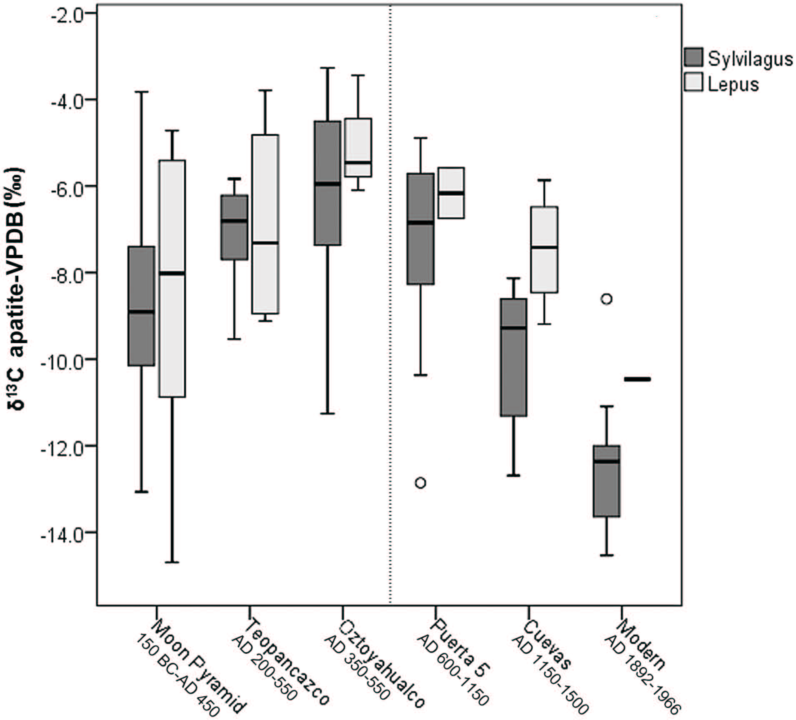

##Introduction
In this document, I outline the reanalyis of Somerville et al. (2016), who examine the evidence for captive management of leproids at Teotihuacan, one of the earliest and largest urban centers in the Americas. Somerville et al. (2016) analysed the carbon and oxygen stable isotopes from the bone apatite of archaeological specimens from two genera of lepoids, Lepus (hares), and Sylvilagus (cottontails). Carbon is used as a proxy for human impact on the diet of these animals: higher δ13C apatite ratios imply an larger component of the diet was made up by human cultivated C4 or CAM plants such as maize. They incorperate the stable carbon isotope analysis with stable oxygen isotope analysis, as δO18 apatite ratios can be used in this context as a proxy for local humidity, providing a measure of control over environmental changes that might have influence baseline signatures of δ13C. 

Their dataset (S2_Table.csv) contains the carbon and isotope ratios from five different parts of the city, some of which overlap slightly in period of occupation. The Moon Pyramid, Teopancazco and Oztoyahualco sites are the three that cover the classic period (150BC-550AD) occupation of Teotihuacan, and overlap somewhat in their occupation ranges. Puerta 5 and Cuevas (here Tunels y Cuevas), refer respectively to the epi-classic (600-1150AD) and post-classic (Aztec, 1150-1500AD) periods of occupation at the site. They also analysed a sample of "modern" (1892-1966AD) comparative specimens from the Basin of Mexico (S1_Table.csv), although these were not taken from Teotihuacan valley, they should be fairly representative of the recent agricultural landscape in the area.

As previous research had indicated the neighborhood of Ozotoyahualco might have specialised in raising cottontail rabbits, Somerville et al. (2016) hypothesised that this site would have a higher δ13C than other parts of the city. Similarly, due to previous research on urban provisioning and the declining prevalence of deer in the region during the classic period, they hypothesised that management of small animals such as leproids would become more important over time, and that this should be associated with an increase in δ13C across the sites during Teotihuacan's classic period occupation. Finally, due to certain biological and behavioural differences between Lepus and Sylvilagus, the authors hypotheses that while both may have been managed by humans, Sylvilagus would be more suitable to captive management in an urban center, and thus would likely have a higher δ13C than Lepus. 

###Outline of their project and my replication 

In their analysis, they perform a variety of descriptive and interpretive analyses, as well as vizualisation of the data. I plan to replicate all of their tests. 

1. **Load** and **clean** data to remove outliers and any samples that failed their quality check
2. Test for statistical differences between genera by calculating simple **descriptive statistics** and analysis with **student's T-test**. 
3. Two, **two-factor analysis of variance tests** to evaluate the effect of genus and site on δ13C and δ18O as well as potential for interaction effects between genus and site. They also present a summary table of means and standard deviation broken down by site and genus. 
4. After genus was found to have no effect, the analysis focused on site. They performed a **one-way ANOVA** and a **post-hoc Tukey test** on each of δ13C and δ18O to assess which sites had an effect on the two variables. One site was found to have a sigificant effect on δ13C, so a **Mann-Whitney-U** (two sample Wilcox rank sum test) test was employed to compare the means of that one site to the remainder of the sample. 
5. The final step was visualising the data in a **scatterplot** of the means and standard deviation of each site for the two main variables (δ13C and δ18O) and two **boxplots** grouped by site. In this step they interpret ideas about how δ13C increased over time at Teotihuacan, and use **Pearson's test** for correlation between the two variables to rule out environmental causes for the interpretations about δ13C.

##Step 1. Load and clean data

First I run a code to clear the workspace, to avoid too many variables building up in my environment and start with a blank slate each time I run the entire length of code. 
```{r clear workspace}
rm(list=ls())
```

### Load data

I read in the archaeological data (S1_table). In excel, I deleted any rows of non-table data, i.e. title, and a note, and saved the file (S2_Table) as a CSV in the project directory. Then I read it into R and converted it to a table using dplyr. I trimed white space at beginnings and ends of things where there shouldn't be any, and kept strings as for now. Initially I used the skip code to remove the headers of the table instead of excel, but I had trouble at some point and simply removed these in the saved file. 

```{r reading in the archaeological data}
require(curl)
require(dplyr)
f <- curl("https://raw.githubusercontent.com/mazattack/data-reanalysis-assignment/master/S2_Table.csv") #This is the archaeological data.
iso_total <- read.csv(f, header = TRUE, stringsAsFactors = FALSE, strip.white=TRUE)
iso_total<-tbl_df(iso_total)
head(iso_total)
str(iso_total)
```
I did the same with the modern data. 
```{r readfile modern}

f <- curl("https://raw.githubusercontent.com/mazattack/data-reanalysis-assignment/master/S1_Table.csv") #This is the archaeological data
modern<-read.csv(f, header=TRUE, sep = ",",strip.white=TRUE, stringsAsFactors = FALSE) 

modern<-tbl_df(modern)
head(modern)
str(modern)
```

###Clean data

To make life easier, I changed the names of two key variables because they were long and involved weird characters. First I tried 18O and 13C as the variable names, but it threw me an error, I think by starting with a number. 
```{r rename}
names(iso_total)[12]<-"C13ap" #I used names(iso_total) to get the position of these for renaming
names(iso_total)[13]<-"O18ap"
names(iso_total)[1]<-"lab_n"
names(modern)[10]<-"modC13"
names(modern)[11]<-"modO18"
```

The first step in their analysis is to remove samples potentially affected by diagenisis. In this article, they tested a random sample (n=101) of bone for potential post-depositional alteration to the mineral structure. Using FTIR, they tested the carbonate to phospate ratios (C/P) and infrared splitting factor (IR-SF) using FTIR and removed samples which fell outside of the expected ranges of 0.1 and 0.5 for C/P and 2.0 and 4.0 for IR-SF. The samples that they removed are marked in grey in the supplimentary data. 

Here, I used the filter function to select only those rows where C/P and IR-SF fell within the expected ranges, and saved this as a new dataset "iso". I also needed to make sure the rows with NA values were still included, since only a random sample was analysed. I did this using the | notation which functions like "OR". Since the FTIR analysis returned both C/P and IR-SF values, I only need to include one is.na function here. I also excluded an outlier with an extremely low δO18 that they excluded by converting this number to NA, as the sample's δ13C value was still incorperated in the analysis.

```{r filter out diagenisis}
#to filter out only Lepus and Sylvilagus genus, I first needed to define the column as a factor
iso_total$Genus<-as.factor(iso_total$Genus)
iso<-filter(iso_total, (Genus=="Lepus" | Genus=="Sylvilagus") & between (C.P, 0.1, 0.5)&between (IR.SF, 2.0, 4.0) | (is.na(IR.SF))) #brackets around the Genus filter were important here, otherwise the | worked on everything that came after
iso$O18ap[iso$O18ap==11.9]<-NA #couldn't figure out how to get this to work with dplyr or chaining
iso            
```

There were a couple rows at the end of the dataset with no data in them so this excluded those from the dataset too. 
```{r}
iso<-filter(iso, !(is.na(iso$Genus))) #removes empty rows
```

##Step 2. Test for differences between genera

### Descriptive statistics
In order to test whether there was a significant difference in the isotopic values between Lepus and Sylvilagus, Somerville et al. (2016) first provide some summary statistics for the dataset which I calculated to ensure I had correctly removed all the outliers from the same. 

**Descriptive statistics from the article (Somerville et al. 2016:10)**

*Archaological specimens:*

  δ13Capatite = -7.8 ± 2.4‰(N = 114, 1 S.D.)
  
  δ18Oapatite = 26.0‰(N = 113, 1 S.D.)
  
*Modern reference specimens:*

  δ13Capatite = -12.4 ± 1.8‰(N = 13, 1 S.D.)
  
  δ18Oapatite = 26.1‰± 1.4 (N = 13, 1 S.D.)
  
```{r sum_table}
my_sum <- 
  list("Archaeological samples" = 
        round (c("δC13 n" = sum(!is.na(iso$C13ap)),
              "δC13 mean" =  mean(iso$C13ap, na.rm=TRUE),
              "δC13 sd" =  sd(iso$C13ap, na.rm=TRUE),
              "δO18 n" = sum(!is.na(iso$O18ap)),
              "δO18 mean" =  mean(iso$O18ap, na.rm=TRUE),
              "δO18 sd" =  sd(iso$O18ap, na.rm=TRUE)),2),
       "Modern samples" = 
         round(c("δC13 n" = sum(!is.na(modern$modC13)),
              "δC13 mean" =  mean(modern$modC13, na.rm=TRUE),
              "δC13 sd" =  sd(modern$modC13, na.rm=TRUE),
              "δO18 n" = sum(!is.na(modern$modO18)),
              "δO18 mean" =  mean(modern$modO18, na.rm=TRUE),
              "δO18 sd" =  sd(modern$modO18, na.rm=TRUE)),2)
       )
    
my_sum
```
My summary statistics closely match those presented in the article. 

Note: the first time I tried this it was not a match and so I realised I needed to keep the na values in the filter above. The second time it was also not correct so I added two lines to count the number of values in the two columns of interest to see if the sample sizes match. I noted the single value from delta O18 to remove but I still have one extra row in there than their sample number. I checked on the excel, and there is no evidence of this extra row that they excluded. I took a guess that this may have been a species listed in the spreadsheet as Lepus? and removal of this specimen now produces averages that match the data presented in the article. 

###T-tests

They then calculate student's T-tests to evaluate whether there is a significant difference in the means of the δ13C and δ18O between Lepus and Sylvilagus. 

First I created a short hand name for each variable group
```{r}
LC<-iso$C13ap[iso$Genus=="Lepus"]
SC<-iso$C13ap[iso$Genus=="Sylvilagus"]
LO<-iso$O18ap[iso$Genus=="Lepus"]
SO<-iso$O18ap[iso$Genus=="Sylvilagus"]
```

####Carbon apatite two sample T-test
```{r}
t.test(LC, SC, var.equal =TRUE, alternative = "two.sided")
```

####Oxygen apatite two sample T-test
```{r}
t.test(SO, LO, var.equal =TRUE, alternative = "two.sided")
```
**Summary of my results**

Carbon apatite t-sample t-test comparing Lepus and Sylvilagus: t = 0.5185, df = 112, p-value = 0.6051

Oxygen apatite t-sample t-test comparing Lepus and Sylvilagus: t = -0.83133, df = 111, p-value = 0.4076

**Test values reported in Somerville et al. (2016:10)**

δ13Capatite values (t[110] = -0.806, p = 0.422)

δ18Oapatite values (t[110] = 0.428, p = 0.669)

Both of these tests returned different test statistics, degrees of freedom and p-values to those reported by Somerville et al. (2016). I tried multiple variations of the t-test in R, from Welsh t-test and one sided t-tests to one sided Welsh t-tests and none of the tests produced a similar result to those reported by Somerville. It later became clear there was an error in either their reported data or supplimentary data - see step 3 for explanation. That said, the outcome of all tests is the same, there is no significant difference in the means of the samples. 

###Test for normality
While they did not report any tests for normality, I also decided to do a cursory check of the suitability of students T-test to these data. I check that the data fits a normal distribution by viewing their histogram, qnorm and qqline plots as well as performing the shapiro test for normality. Finally, I also test for equal variance between the samples.

####δ13C

```{r carbon normality test}
require(ggplot2)
a_hist<-ggplot(iso, aes(C13ap))
a_hist+geom_histogram(bins= 15)+ facet_wrap(~Genus, scales="free") #I couldn't figure out how to get rid of the blank chart at the start
qqnorm(LC,xlab="Theoretical",main="Lepus")
qqline(LC)
  
qqnorm(SC,xlab="Theoretical",main="Sylvilagus")
qqline(SC)
  
shapiro.test(LC) #Lepus
shapiro.test(SC) #Sylvilagus

var.test(LC, SC) #test of equal variance
```
In these tests, Sylvilagus looks approximately normal while Lepus has a more noticeable skew. However both pass the Shapiro-Wilk test and have equal variance (although would have failed this test if alpha were 0.1) so are likely normal enough to trust the t-test results. 


####δ18O

```{r oxygen normality test}
require(ggplot2)
a_hist<-ggplot(iso, aes(O18ap))
a_hist+geom_histogram(bins=15)+ facet_wrap(~Genus, scales="free")

qqnorm(LO,xlab="Theoretical",main="Lepus")
qqline(LO)

qqnorm(SO,xlab="Theoretical",main="Sylvilagus")
qqline(SO)

shapiro.test(LO) #Lepus
shapiro.test(SO) #Sylvilagus

var.test(LO, SO)
```

Here, Lepus fits the normal distrbution well, while Sylvilagus is divergent. Looking at the histgram again, it could potentitally be bimodal. If this were my data, I would explore that possibility further as it could potentially indicate sylvilagus a group of rabbits with different environmental backgrounds. However, both past the Shapiro-Wilk test and appear to have equal variances so the t-test should be ok. 

##Step 3: Test for effects of site and genus 
The article uses **two-factor analysis of variance tests** to evaluate the effect of genus and site on δ13C and δ18O as well as potential for interaction effects between genus and site. They also present a summary table of means and standard deviation broken down by site and genus. 

###Summary table:
I created the summary table to compare to their Table 2

First I factorize Genus and define levels of the modern dataset in order to merge with the archaeological dataset
```{r create genus column in modern}
Genus<- as.factor(modern$Species) 
modern<-cbind(modern, Genus)
levels(modern$Genus)[levels(modern$Genus)=="Lepus californicus texianus"]<-"Lepus"
levels(modern$Genus)[levels(modern$Genus)=="Sylvilagus floridanus"]<-"Sylvilagus"
levels(modern$Genus)[levels(modern$Genus)=="Sylvilagus floridanus orizabae"]<-"Sylvilagus"
levels(modern$Genus)    
```
Here I code the merge, selecting only the necessary columns
```{r merge modern and iso datasets}
new<-select(iso, lab_n, Site, Phase, Genus, C13ap, O18ap)
new2<-select(modern, lab_n=Lab_num, Site=State, Phase=Collection.date..yrs.AD., Genus, C13ap=modC13, O18ap=modO18)%>%mutate(Site="modern") #Giving the modern dataset a "site" variable
iso2<-rbind(filter(new,(!(is.na(C13ap)))), new2) #merging with rbind
iso2
```
Finally I put together the summary table. I decided not to also include the subtotal row in this table, as that would be needlessly complicated and is not something I would typically use R for. 

```{r constructing the summary table}
iso2$Genus <-as.factor(iso2$Genus)
iso2_g <- group_by(iso2, Site, Genus)
sum_tot<- summarize(iso2_g, length(C13ap), mean(C13ap, na.rm=T), sd(C13ap, na.rm=T), length(O18ap), mean(O18ap, na.rm=T), sd(O18ap, na.rm=T))

tot_tot<-iso2%>%
  group_by(Genus)%>%
  summarize(length(C13ap), mean(C13ap, na.rm=T), sd(C13ap, na.rm=T), length(O18ap), mean(O18ap, na.rm=T), sd(O18ap, na.rm=T))
tot_tot<-mutate(tot_tot, Site="Total")
tot<-rbind.data.frame(sum_tot, tot_tot)
require(knitr)
kable(tot)#using knitr to ensure the entire table is visible in the html output
```

Note the differences across these summary statistics compared to the table provided in the article (Table 2). 


This reflects a difference in the data from the article compared to what they provided in the supplimentary data. I checked this in excel to confirm. It seems a few cases were moved between contexts and genus variables, so while this difference is not enough to substantially throw off my results, most of the tests do not match up exactly. 

###Two-way ANOVA
 
The article employed two, **two-factor analysis of variance tests** to evaluate the effect of genus and site on δ13C and δ18O as well as potential for interaction effects between genus and site. I tested the type II anova, which would be better for the unbalanced design, however they gave almost identical p-values so I continued with type I for ease here. 
```{r carbon anova}
carbon<-lm(iso$C13ap~iso$Genus*iso$Site)
anova(carbon)#not sure why but moon pyramid is missing from all these ANOVA, and then we had that class and now I know.
plot(carbon$residuals)# I also decided to check out the residuals
```
```{r oxygen anova}
oxygen<-lm(iso$O18ap~iso$Genus*iso$Site)
anova(oxygen)
plot(oxygen$residuals)# I also decided to check out the residuals
```


**Somerville et al's (2016) two-way ANOVA results:**

"For δ13C apatite, the main effect for genus was not significant (F[1,102] = 3.361), p = 0.070), but the main effect of site context was significant (F[4,102] = 5.365, p = 0.001). Importantly, the interaction between genus and site was not significant for δ13Capatite (F[4,102] = 0.590, p<0.670) or for δ18Oapatite (F[4,102] = 0.834, p<0.507)."

While the values do not match exactly due to the error in the dataset, my two way Anova summaries match the conclusions they derived in the article. That Genus had no significant effect on either δ13C or δO18 apatite ratios. However there is a significant effect of Site location on these variables. Also, the residuals show no clear patterns that would indicate another major influencing variable on these data. 

##Step 4. Identifying the site factors effecting the isotopic signature

After genus was found to have no effect, the analysis focused on site. Somerville et al. (2016) performed a **one-way ANOVA** and a **post-hoc Tukey test** on each of δ13C and δ18O to assess which sites had an effect on the two variables. One site was found to have a sigificant effect on δ13C, so a **Mann-Whitney-U** (two sample Wilcox rank sum test) test was employed to compare the means of that one site to the remainder of the sample. 

###One way ANOVA tests and post-hoc Tukey test
####δ13C
```{r carbon one way}
carbon2<-lm(iso$C13ap~iso$Site) 
m <- aov(iso$C13ap~iso$Site)
summary(m)
posthoc <- TukeyHSD(m, "iso$Site", conf.level = 0.95)
posthoc 
```
The one way ANOVA test for δ13C also identified a significant effect of site on δ13C and the post-hoc Tukey test highlights significant differences in the δ13C between Oztoyahualco-Moon Pyramid, Teopancazco-Moon Pyramid and Túneles y Cuevas-Oztoyahualco. This mirrors Somerville et al.'s (2016) findings and implys that leproids at Oztoyahualco had a higher levels of C4 plants in the diet. This supports the theory that residents at Oztoyahualco may have been raising leproids. 

*Somerville et al.'s (2016:10) One-way ANOVA and Tukey results:* "Significant differences were found in δ13Capatite (F[4, 107] = 5.8, p<0.001). Post-hoc Tukey tests indicate that Oztoyahualco leporids had significantly higher δ13Capatite values than those of the Moon Pyramid and the Cuevas"

####δ18O

```{r oxygen one way}
m <- aov(iso$O18ap~iso$Site)
summary(m)
posthoc <- TukeyHSD(m, "iso$Site", conf.level = 0.95)
posthoc  
```
The one way ANOVA test for δ18O also identified a significant effect of site on δ18O and the post-hoc Tukey test highlights significant differences in the δ18O between Puerta 5-Moon Pyramid, Teopancazco-Oztoyahualco and Teopancazco-Puerta 5. This mirrors Somerville et al.'s (2016) findings.

**Somerville et al.'s (2016:11) One-way ANOVA and Tukey results:**
"Significant differences were also found in δ18Oapatite means between site contexts (F[5, 120] = 4.704, p<0.001), but no obvious temporal trends were observed (Fig 6). Post-hoc Tukey tests revealed significant differences in δ18O apatite between Oztoyahualco and Teopancazco (p = 0.046), between Puerta 5 and Teopancazco (p<0.001), and between Puerta 5 and the Moon Pyramid (p = 0.008)."

###Mann-Whitney-U test
Finally, to confirm that the mean δ13C samples from Oztoyahualco are significantly different from the remainder of the site, they performed a Mann-Whitney-U test. 

```{r Mann-Whitney U carbon}
group1<-(iso2) %>%
  filter(Site!="modern", Site!="Oztoyahualco") %>%
  select(C13ap)
group2<-(iso2) %>%
  filter(Site=="Oztoyahualco") %>%
  select(C13ap)
group1<-as.numeric(unlist(group1)) #there was some weird stuff going on, but unisting it worked
group2<-as.numeric(unlist(group2))
wilcox.test(group1, group2)
```
As they expected, mean δ13C is siginifancly higher than other areas at Teotihuacan which supports the theory that residents at Oztoyahualco may have been raising leproids. 

**Somerville et al.'s (2016:11) Mann-Whitney-U test for δ13C apatite:** (U = 329, p = 0.001)

```{r Mann-Whitney U oxygen}
group1<-(iso2) %>%
  filter(Site!="modern", Site!="Oztoyahualco") %>%
  select(O18ap)
group2<-(iso2) %>%
  filter(Site=="Oztoyahualco") %>%
  select(O18ap)
group1<-as.numeric(unlist(group1))
group2<-as.numeric(unlist(group2))
wilcox.test(group1, group2)
```
No significant differences were identified for the δ18O between Oztoyahualco and the remainder of the site. They do not interpret this result, but I imagine it supports the conclusion they make later which is that differences in δ13C cannot be attributed to environmental change as measured by δ18O values. This result closely matches their test. 

**Somerville et al.'s (2016:11) Mann-Whitney-U test for δ18O apatite:**(U = 636, p = 0.434).

##Step 5: Data visualisation

The final step was visualising the data in a **scatterplot** of the means and standard deviation of each site for the two main variables (δ13C and δ18O) and two **boxplots** grouped by site. In this step they interpret ideas about how δ13C increased over time at Teotihuacan, and use **Pearson's test** for correlation between the two variables to rule out environmental causes for the interpretations about δ13C.

###Scatterplot
First I relabel the site factors to include the temporal information
```{r relabel levels of Site, note that runing this twice will erase the data}
iso2$Site = factor(iso2$Site, c("Moon Pyramid", "Teopancazco", "Oztoyahualco", "Puerta 5", "Túneles y Cuevas", "modern"), labels=c("Moon Pyramid (150 BC-AD 450)", "Teopancazco (AD 200-550)", "Oztoyahualco (AD 350-550)", "Puerta 5 (AD 600-1150)", "Túneles y Cuevas (AD 1150-1500)", "modern (AD 1892-1966)"))
```
Then calculate summary statistics to create the summary graph Figure 4. 
```{r carbon v oxygen scatterplot}
gm <- iso2 %>% 
        group_by(Site) %>% 
        summarise(mean_C13ap = mean(C13ap),
                  mean_O18ap  = mean(O18ap, na.rm=T),
                  C13SD=sd(C13ap),
                  O18SD=sd(O18ap, na.rm=T))
gm
require(ggplot2)
g<-ggplot(gm, aes(x=mean_C13ap, y=mean_O18ap, shape = Site))
g+geom_point(data=gm, size=4)+ xlim(-16, -1) +ylim(21, 31)+
      geom_errorbarh(data = gm,aes(xmin = mean_C13ap - C13SD,xmax = mean_C13ap + C13SD,y = mean_O18ap)) + 
    geom_errorbar(data = gm,aes(ymin = mean_O18ap - O18SD,ymax = mean_O18ap + O18SD,x = mean_C13ap)) +
  labs(x="δ13C apatite-VPDB (‰)", y="δ18O apatite-VSMOW (‰)") +
  annotate(geom = "text", x = -12, y = 22, label = "note error bars are SD")
```

Compare this to their figure 4 (below)


###Box plots
#### δ13C
```{r carbon boxplot}
require(stringr)
g<-ggplot(iso2, aes(x=Site, y=C13ap))
g<-g+geom_boxplot(aes(fill=Genus))+
  ylim(-16, -2) +
  labs(x="" ,y="δ13C apatite-VPDB (‰)") +
  scale_color_manual(values=c("black", "black"))+
  scale_fill_manual(values=c( "grey90", "grey45"))+
  theme(axis.text.x = element_text(size=8, angle=45, hjust = 1))+
  scale_x_discrete(labels = function(x) str_wrap(x, width = 15))+#this wraps the text on the x axis
   coord_fixed(.45)+
    geom_vline(aes(xintercept = 3.5), linetype=2) #this line separates classic period of Teotihuacan from epi and post Classic phases
g

ggsave(filename = "carbon_box.png", g,
       width = 8, height = 9, dpi = 300, units = "in", device='png')
```
There are clear temporal trends in the δ13C values at Teotihuacan, generally increasing in the Classic period and decreasing after the classic period. 
Compare to Figure 5 (below)


####δ18O
```{r oxygen boxplot}
require(stringr)
g<-ggplot(iso2, aes(x=Site, y=O18ap))
g<-g+geom_boxplot(aes(fill=Genus))+
  ylim(18, 32) +
  labs(x="" ,y="δ18O apatite-VSMOW (‰)") +
  scale_color_manual(values=c("black", "black"))+
  scale_fill_manual(values=c( "grey90", "grey45"))+
  theme(axis.text.x = element_text(size=8, angle=45, hjust = 1))+
  scale_x_discrete(labels = function(x) str_wrap(x, width = 15))+
   coord_fixed(.45)+
   geom_vline(aes(xintercept = 3.5), linetype=2)
g

ggsave(filename = "oxygen_box.png", g,
       width = 8, height = 9, dpi = 300, units = "in", device='png')
```
There is no obvious temporal trend in oxygen isotopes. 
Compare to Figure 6 (below)


The observations from the previous plots suggest no major correlation between Oxygen and Carbon isotope. This was tested using Pearson's correlation test and the results supported their observation of no significant correlation. 

### Pearson's Correlation
```{r}
cor.test(x=iso2$C13ap, y=iso2$O18ap, method= "pearson")
```
**Somerville et al.'s (2016:14) Pearson's correlation:** (R = -0.003, p = 0.971).

